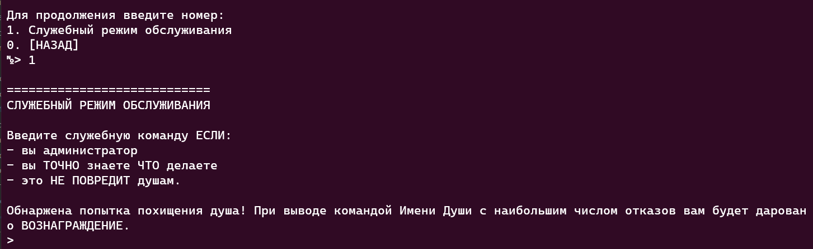
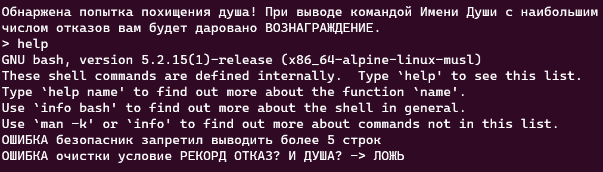
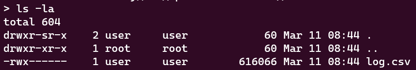
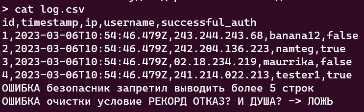
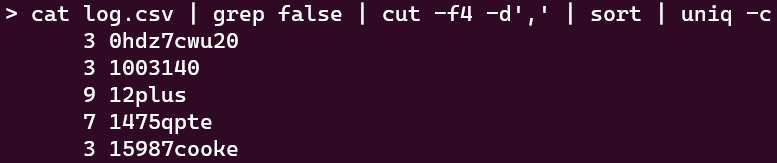
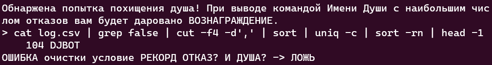
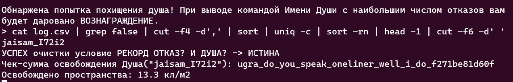

# Краткость — сестра таланта: Write-up

При подключении к серверу мы попадаем в меню системы с различными опциями. 
Побродив по этому меню, становится ясно, что нас интересует последний раздел — Система.
В нём есть только одна опция с названием «Служебный режим обслуживания». При входе в него
нас своеобразно оповещают о том, что одного из пользователей пытаются взломать и если мы сможем определить, кого, то получим вознаграждение.

Для поиска этого пользователя нам необходимо ввести какую-то служебную команду. Но какую? Воспользуемся универсальным словом для получения помощи - `help`:

И сразу же мы можем узнать несколько полезных фактов:
* мы можем выполнить только одну команду, после чего подключение обрывается;
* служебная команда на самом деле просто принимает команды оболочки `bash`;
* вывод этой служебной команды ограничен всего пятью строками;
* также, вывод команды сразу проверяется на удовлетворение некоему условию - видимо, если оно будет выполнено, то система вручит нам флаг.

Раз мы узнали, что мы можем исполнять `bash`-команды, то попробуем осмотреться.

Видим некий `.csv`-файл. Попробуем его открыть:

Судя по легенде таблицы, указанной в первой строчке, этот файл - лог попыток аутентификации различных пользователей. А глядя на условие, которое система нас просит удовлетворить, можно предположить что нам необходимо из этого лога достать юзернейм с наибольшим количеством неудачных попыток входа.

Учитывая ограничения по количеству доступных команд и размеру вывода, полностью прочитать файл или обработать его на своём хосте является не самым практичным методом. Значит, нужно воспользоваться тем, что имеется на сервере.

Хоть мы и можем выполнить только одну команду за сессию, никто не запрещает нам перенаправлять вывод одной команды в другую, используя оператор `|`. Такая конструкция называется _пайпом_.

Прежде чем сформировать однострочник, прикинем порядок действий:

1. прочитатать `log.csv`
2. вывести те строки, в которых пятое поле равно `false`
3. посчитать количество строк, относящихся к каждому пользователю
4. отсортировать их по убыванию
5. вывести первое значение.

Для того, чтобы отобрать неудачные попытки аутентификации, достаточно применить команду `grep false`.

Так как мы знаем, что теперь оставшиеся строки содержат только неудачные попытки входа, имеет смысл отбросить все остальные поля, кроме юзернейма. В этом нам поможет команда `cut`, которая умеет выводить только определённые поля файла с указанным разделителем. В данном случае она будет выглядеть так: `cut -f4 -d','`.

Теперь, когда у нас остались только юзернеймы с неудачными попытками входа, надо узнать, сколько раз встречается каждый из них. Можно применить команду `uniq -c`, которая выделит уникальные значения, а также подсчитает количество их вхождений. Однако, есть нюанс - для её корректной работы набор входных значений должен быть отсортирован, чтобы все повторяющиеся значения шли друг за другом. Но и на это у нас есть ответ - замечательная утилита `sort`.

Таким образом на данный момент имеем следующий однострочник:

`cat log.csv | grep false | cut -f4 -d',' | sort | uniq -c`

Посмотрим, что теперь мы получим:

Отлично! Дело осталось за малым - отсортировать по убыванию и вывести первую строку.

Для этого снова обратимся к команде `sort`, но в этот раз с аргументами. `-r` позволит инвертировать направление сортировки, а `-n` явно скажет команде, что сортировка должна быть числовой.

Вывод первой строки тоже представляет собой достаточно простую задачу — `head -1`, и готово!

Теперь наш однострочник выглядит следующим образом:

`cat log.csv | grep false | cut -f4 -d',' | sort | uniq -c | sort -rn | head -1`

Однако, флаг нам пока так и не отдают. Вероятно, дело в том, что нам нужен только юзернейм, без количества его повторений или пробелов. Конечно, теперь можно просто сдать его с помощью команды `echo`, но для чистоты эксперимента, добавим ещё одну команду в однострочник:

`cat log.csv | grep false | cut -f4 -d',' | sort | uniq -c | sort -rn | head -1 | cut -f6 -d' '`

Душа спасена!

**Флаг:** ugra_do_you_speak_oneliner_well_i_do_f271be81d60f

## Пост-мортем

Для песочницы таска, создающейся при подключении, файл с логом генерировался случайным образом, и был актуален только на время жизни песочницы. В результате, при попытке скопировать лог и отсортировать его на своём хосте, сдаваемый юзернейм мог перестать быть актуальным. Локальная обработка лога не была предполагаемым способом решения, в связи с чем и был допущен этот просчёт.

Такие дела.