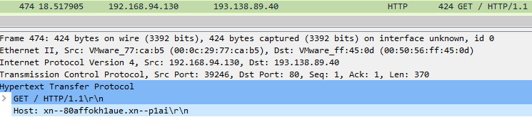
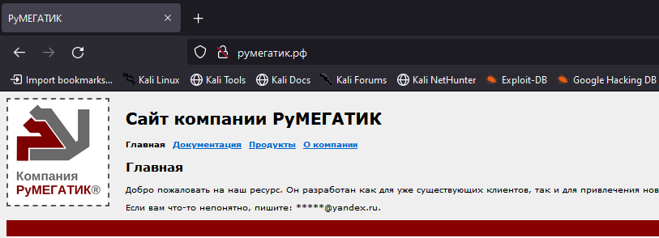
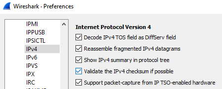
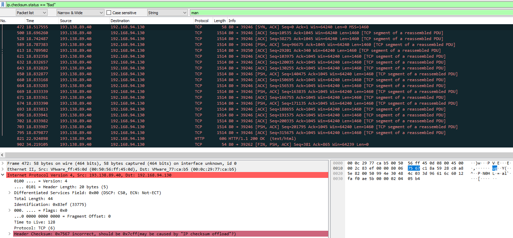
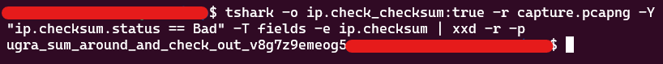

# Циркуляция: Write-up

При открытии дампа с трафиком обратим внимание на HTTP-сессии, в нём содержащиеся.
В заголовках HTTP-запросов можно увидеть, что обращение идёт к серверу с интересным доменом, закодированным в Punycode:

Воспользовавшись любым удобным декодером, узнаём, что это домен [румегатик.рф](http://румегатик.рф), и видимо, принадлежит компании, разработавшей защищённый роутер, с которого был снят рассматриваемый дамп.

Для того, чтобы узнать, что же содержится на сайте, можно либо декодировать содержимое сайта из дампа (Wireshark по умолчанию не отобразит кириллицу), либо же просто открыть его в браузере.

Изучив сайт, можно наткнуться на страницу «Документация», на которой технические характеристики роутера описаны в красочных подробностях. В том числе, рассказывается о режиме сокрытой передачи данных «РуЦУЦ», который позволяет «капсульно передавать данные в удостоверениях целостности сетевого слоя». Как известно, на сетевом слое, а точнее, уровне, работает протокол IP, а для удостворения целостности его пакетов используется механизм контрольных сумм. Видимо, секретные данные как-то передаются именно с их помощью.

Но если просто начать смотреть на контрольные суммы пакетов дампа, то вряд ли получится увидеть что-то интересное, ведь Wireshark любезно нам сообщает, что проверка контрольных сумм отключена.

Для включения проверки контрольных сумм нужно поставить соответствующую галочку в настройках Wireshark (`Edit -> Preferences -> Protocols -> IPv4`):

И сразу же после включения этой настройки видно, как некоторые пакеты подсвечиваются тёмным цветом, а в IP-заголовках таких пакетов сообщается о нарушении контрольной суммы. Отфильтруем все такие пакеты с помощью следующего выражения: `ip.checksum.status == "Bad"`:

В хексдампе первого пакета видим, что байты чексуммы декодируются как `ug`, а второго - как `ra`. Судя по всему, технология сокрытой передачи данных заключается в том, что роутер подменяет чексумму произвольного пакета фрагментом передаваемого сообщения. Извлечём все битые чексуммы из дампа и декодируем их с помощью следующей команды:

`tshark -o ip.check_checksum:true -r capture.pcapng -Y "ip.checksum.status == Bad" -T fields -e ip.checksum | xxd -r -p`

Вот мы и получили наше секретное сообщение.

**Флаг:** ugra_sum_around_and_check_out_v8g7z9emeog5
