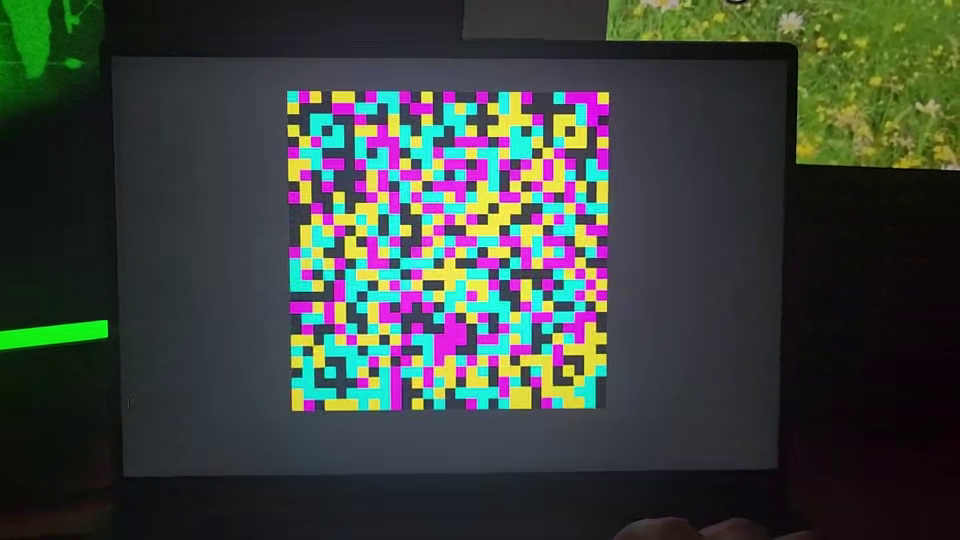
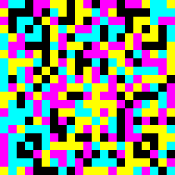
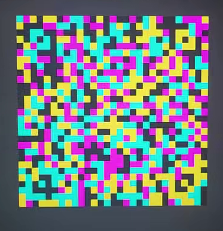
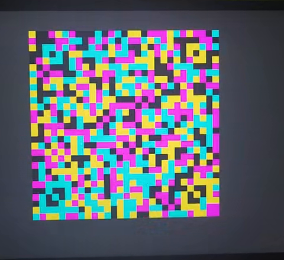
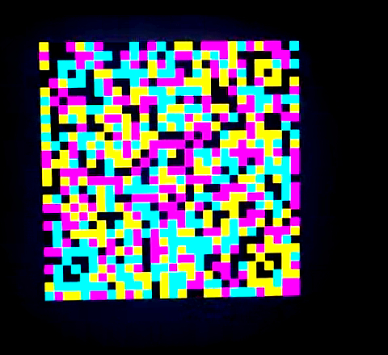

# [ДАННЫЕ УДАЛЕНЫ]: Write-up

Имеем видео, на котором видно, как незадачливый агент крадет файл `flag.png` с мейнфрейма посредством JAB-кодов. На одном из кадров видно описание команды `jab`:

```
jab: JAB code encoder
Usage: jab <file>
Encodes the file via base64, splits it into chunks and outputs the chunks one by one to stdout
```

Для начала хотелось бы понять, что вообще такое JAB-коды. Типичный кадр видео, содержащий код, выглядит так:



Гугл на запрос «jab code» выдает сайт [jabcode.org](https://www.jabcode.org/). Если поиграться и посоздавать тестовые коды, например, из текста `12345`, то получится что-то, напоминающее кадр выше, но более цветастое. Если же число цветов снизить до 4, получится как раз картинка такого же вида:



Но вот если загрузить на сайт кадр из видео, то ответом будет `No message has been found.`. Попробуем упростить программе задачу, обрезав картинку:



И это успех, сайт расшифровывает ее как

```
iVBORw0KGgoAAAANSUhEUgAAA4QAAABACAYAAABC37kEAAAjnElEQVR4nO3deVxU1f8/8NeAAyObCIqiaLihnxBIUXHHDdHEJZdP
```

что явно похоже на кусок base64, разделённого по 100 символов.

По-видимому, так придется проделать с каждым кадром видео. Можно их выдирать, например, руками, можно какой-нибудь графической программой, а можно автоматизировать процесс через `ffmpeg`:

```bash
mkdir frames
ffmpeg
	-ss 47.0  # скипаем первые 47 секунд, в которые ничего не происходит, чтобы не занимать место на диске
	-i video.mkv
	-r 10  # доставать по 10 кадров в секунду
	-filter:v crop=480:440:225:50  # обрезать, чтобы в кадр попал только JAB-код
	frames/%06d.png
```

Получится что-то в духе:



После этого, заливая файлы по одному на сайт, можно убедиться, что нормально распознаётся всё равно только половина кадров. Пойдём дальше и попробуем сделать картинку более контрастной, как в примерах, чтобы использовались только четыре чётких цвета, как в коде, сгенерированном сайтом. Такое обычно делается через imagemagick; погуглив «imagemagick increase contrast», получаем такой код:

```bash
mkdir saturated-frames
for frame in frames/*; do
	convert $frame -brightness-contrast 0,50 saturated-$frame
done
```



Эти коды уже распознаются стабильно.

Процесс хочется оптимизировать, а то ходить на сайт с каждой картинкой — не дело. Загуглив «jabcode github», находим [репозиторий с декодером](https://github.com/jabcode/jabcode). Там даже написано, как его собрать:

```shell
$ git clone https://github.com/jabcode/jabcode
Cloning into 'jabcode'...
remote: Enumerating objects: 590, done.
remote: Counting objects: 100% (45/45), done.
remote: Compressing objects: 100% (22/22), done.
remote: Total 590 (delta 30), reused 24 (delta 23), pack-reused 545
Receiving objects: 100% (590/590), 14.87 MiB | 1.67 MiB/s, done.
Resolving deltas: 100% (330/330), done.

$ cd jabcode/src/jabcode

$ make
gcc -c -I. -I./include -O2 -std=c11 binarizer.c -o binarizer.o
gcc -c -I. -I./include -O2 -std=c11 decoder.c -o decoder.o
gcc -c -I. -I./include -O2 -std=c11 detector.c -o detector.o
gcc -c -I. -I./include -O2 -std=c11 encoder.c -o encoder.o
gcc -c -I. -I./include -O2 -std=c11 image.c -o image.o
gcc -c -I. -I./include -O2 -std=c11 interleave.c -o interleave.o
gcc -c -I. -I./include -O2 -std=c11 ldpc.c -o ldpc.o
gcc -c -I. -I./include -O2 -std=c11 mask.c -o mask.o
gcc -c -I. -I./include -O2 -std=c11 pseudo_random.c -o pseudo_random.o
gcc -c -I. -I./include -O2 -std=c11 sample.c -o sample.o
gcc -c -I. -I./include -O2 -std=c11 transform.c -o transform.o
ar cru build/libjabcode.a binarizer.o decoder.o detector.o encoder.o image.o interleave.o ldpc.o mask.o pseudo_random.o sample.o transform.o
ranlib build/libjabcode.a

$ cd ../jabcodeReader

$ make
gcc -c -I. -I../jabcode -I../jabcode/include -O2 -std=c11 jabreader.c -o jabreader.o
gcc jabreader.o -L../jabcode/build -ljabcode -L../jabcode/lib -ltiff -lpng16 -lz -lm -O2 -std=c11 -o bin/jabcodeReader
/usr/local/bin/ld: ../jabcode/lib/libtiff.a(tif_close.o): relocation R_X86_64_32 against `.rodata.str1.1' can not be used when making a PIE object; recompile with -fPIE
/usr/local/bin/ld: failed to set dynamic section sizes: bad value
collect2: error: ld returned 1 exit status
make: *** [Makefile:10: bin/jabcodeReader] Error 1
```

Ага, мы не ищем лёгких путей. Открываем Issues на GitHub, видим открытый баг [Build warnings and errors](https://github.com/jabcode/jabcode/issues/44) с похожей ошибкой и комментарий с рекомендацией скомплировать с `-no-pie`:

```shell
$ make CFLAGS=-no-pie
gcc jabreader.o -L../jabcode/build -ljabcode -L../jabcode/lib -ltiff -lpng16 -lz -lm -no-pie -o bin/jabcodeReader
```

После этого должен появиться файл `bin/jabcodeReader`, которому мы уже можем скармливать кадры:

```bash
for frame in saturated-frames/*; do
	jabcode/src/jabcodeReader/bin/jabcodeReader $frame
done
```

```
JABCode Error: Too few finder pattern found
JABCode Error: Too few finder pattern found
JABCode Error: Decoding JABCode failed
...
JABCode Error: Too few finder pattern found
JABCode Error: Too few finder pattern found
JABCode Error: Decoding JABCode failed
iVBORw0KGgoAAAANSUhEUgAAA4QAAABACAYAAABC37kEAAAjnElEQVR4nO3deVxU1f8/8NeAAyObCIqiaLihnxBIUXHHDdHEJZdP
iVBORw0KGgoAAAANSUhEUgAAA4QAAABACAYAAABC37kEAAAjnElEQVR4nO3deVxU1f8/8NeAAyObCIqiaLihnxBIUXHHDdHEJZdP
VvJQtDQkK7UsQ/tY5kcU/WRZkgspYiGpH/dS0AwFl1QCxJQvi4Y7KCaiiCzn9we/OZ8ZmH3OwCjv5+PB43GZe+bcc84958499557
VvJQtDQkK7UsQ/tY5kcU/WRZkgspYiGpH/dS0AwFl1QCxJQvi4Y7KCaiiCzn9we/OZ8ZmH3OwCjv5+PB43GZe+bcc84958499557
roQxxkAIIYQQQgghpMGxqO8EEEIIIYQQQgipH9QhJIQQQgghhJAGijqEhBBCCCGEENJAUYeQEEIIIYQQQhoo6hASQgghhBBCSANF
roQxxkAIIYQQQgghpMGxqO8EEEIIIYQQQgipH9QhJIQQQgghhJAGijqEhBBCCCGEENJAUYeQEEIIIYQQQhoo6hASQgghhBBCSANF
HUJCCCGEEEIIaaCoQ0gIIYQQQgghDRR1CAkhhBBCCCGkgaIOISGEEEIIIYQ0UNQhJIQQQgghhJAGijqEhBBCCCGEENJAUYeQEEII
HUJCCCGEEEIIaaCoQ0gIIYQQQgghDRR1CAkhhBBCCCGkgaIOISGEEEIIIYQ0UNQhJIQQQgghhJAGijqEhBBCCCGEENJAUYeQEEII
IYQQQhoo6hASQgghhBBCSANFHUJCCCGEEEIIaaCoQ0gIIYQQQgghDRR1CAkhhBBCCCGkgaIOISGEEEIIIYQ0UNQhJIQQQgghhJAG
IYQQQhoo6hASQgghhBBCSANFHUJCCCGEEEIIaaCoQ0gIIYQQQgghDRR1CAkhhBBCCCGkgaIOISGEEEIIIYQ0UNQhJIQQQgghhJAG
...
```

Осталось проигнорировать ошибки, избавиться от повторов и распарсить base64:

```bash
for frame in saturated-frames/*; do
	jabcode/src/jabcodeReader/bin/jabcodeReader $frame
done | grep -v "JABCode Error" | uniq | base64 -d >flag.png
```

В результате получаем картинку:


Флаг: **ugra_airgaps_can_be_bypassed_6m2amyh2xtwm**
