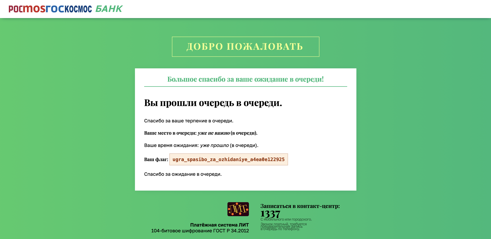

# Очередь: Write-up

Попадая на сайт, мы обнаруживаем себя в очереди. Можно, конечно, попробовать подождать в очереди, но, судя по всему, ожидание в очереди заняло бы слишком много времени в очереди. Попробуем изучить сайт очереди поглубже.

Открываем инструменты разработчика в браузере. В исходном коде ничего особо нет, на вкладке с сетью тоже. А вот на вкладке хранилища можно увидеть две куки: `state` и `state_hash`. Если декодировать URL-энкодинг в `state`, то можно увидеть, что он хранит в себе два числа и таймстамп. Числа легко сопоставить с позицией в очереди и временем ожидания, а таймстамп — со временем последнего обновления. В `state_hash` при этом лежит четыре шестнадцатеричных байта. По названию можно понять, что это хэш от `state`. Методом перебора можно узнать, что это CRC32.

Этих знаний уже достаточно, чтобы пропустить всю очередь. Нужно лишь подставить ноль в качестве позиции в очереди в уже существующую куку и посчитать правильный хэш. После этого можно обновить страницу и получить флаг.

Флаг: **ugra_spasibo_za_ozhidaniye_a4ea0e122925**
