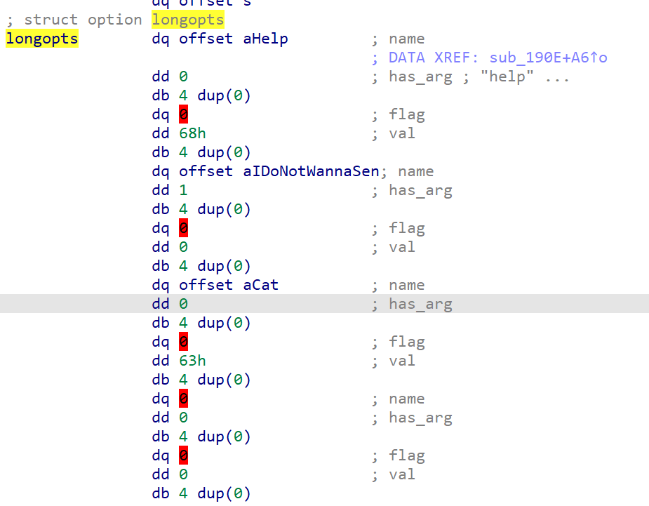

# Minimum system requirements: Write-up

## Шаг 1: Разведка
К заданию нам приложили файл `msr.elf`. Посмотрим, что это за файл.

```bash
$ file msr.elf
msr.elf: ELF 64-bit LSB shared object, x86-64, version 1 (SYSV), dynamically linked, interpreter /lib64/ld-linux-x86-64.so.2, BuildID[sha1]=f052413889b1bff11d6f2d2f165d28bed81ee61a, for GNU/Linux 3.
```

О, отлично. Это 64-битный исполняемый файл для Linux. Попробуем запустить его.

```bash
$ ./msr.elf
System requirements not met
```

Ну что же, видимо, он так просто не запустится. `--help` тоже не помогает:
    
```bash
$ ./msr.elf --help
This is help text, it is very long and it is very useful. If you don't read it, you will be punished.
```

…бинарь сыплет угрозами. 

## Шаг 2: Разбор бинаря

Поскольку это 64-битный бинарь, то его с удовольствием (и что главное, бесплатно!) декомпилирует [IDA Free](https://hex-rays.com/ida-free/). 

> Именно о том, что можно воспользоваться IDA Free, и была подсказка.

Откроем бинарь в ней. К сожалению, бинарь стрипнутый, поэтому в нём нет никаких символов. Будем разбираться по ходу.


В `main` вызывается две функции:
- `sub_190E` — принимает в себя `argc` и `argv`: видимо, там обрабатывается ввод.
- `sub_241B` — ничего не принимает: будем смотреть, что она делает, позднее.

Давайте посмотрим, что делает `sub_190E`:


Здесь мы чётко видим обработку командной строки. В массиве неких структур longopts хранятся возможные опции. Если посмотреть [документацию](https://linux.die.net/man/3/getopt_long) на функцию `getopt_long`, становится понятно, что `longopts` — массив структур `option`, которые содержат в себе имя опции, флаг (нет, не тот), значение опции и номер опции. Даже Ида подсказывает нам об этом, но находит только первую структуру:


Ничего, это дело поправимое, просто наводимся на `longopt`, нажимаем \* на нампаде и определяем, что это массив из 4 элементов:


Получаем красивую таблицу опций:




| name | has_arg | flag | val |
| --- | --- | --- | --- |
| help | no_argument | 0 | 104 == 'h' |
| I_do_not_wanna_send_all_my_logs_to_fbi_but_I_agree_with_it_here_is_my_secret_code_for_this_operation | required_argument | 0 | 0 |
| cat | no_argument | 0 | 99 == 'c' |


Выходит, что `--help` выводит справку, `--cat` (или `-c`) выводит котика (`sub18AC` — вывод одного из четырёх случайных котиков), а длинная опция `I_do_not_wanna_send_all_my_logs_to_fbi_but_I_agree_with_it_here_is_my_secret_code_for_this_operation` сохраняет аргумент в переменную `qword_5140`, которая дальше, вероятно, где-то используется.

## Шаг 3: We need to go deeper

Посмотрим, что делает `sub_241B`:


Здесь мы видим, что инициализируется *ncurses*, выясняются максимальные размеры терминала, проверяется, что размер — минимум 9x9, и что `sub_157F` возвращает ноль. Если проверку не прошли, выводится сообщение *System requirements not met* — и программа завершается.

Давайте посмотрим, что делает `sub_157F`:


Данная функция формирует строчку из элементов, полученных из функций `sub_1A55`, `sub_19DD`, `sub_1A19`, `sub_1AC8`, `sub_1A65`, а также из переменной `qword_5140`, которая задаётся той длинной опцией командной строки. 

Потом эта строчка переадается в функцию `sub_13A7`, а после сравнивается с константой `byte_5160`. Если не совпадает, то фунцкия возвращает 1. В противном случае в `qword_54F0` записывается результат функции `sub_1493` от этой строчки.

Давайте разбираться, что это за функции такие:

```c
__int64 sub_1A55()
{
  return sysconf(84); // _SC_NPROCESSORS_ONLN
}
```

*`sub_1A55` возвращает количество ядер процессора.*

```c
__int64 sub_19DD()
{
  __int64 v0; // rbx

  v0 = sysconf(86); // _SC_PHYS_PAGES
  return v0 * sysconf(30) / 0x40000000;
}
```

*`sub_19DD` возвращает количество гигабайт оперативной памяти.*

```c
__int64 sub_1A19()
{
  __int64 v0; // rbx

  v0 = sysconf(85); // _SC_AVPHYS_PAGES
  return v0 * sysconf(30) / 0x40000000;
}
```

*`sub_1A19` возвращает количество гигабайт свободной оперативной памяти.*

```c
__int64 sub_1AC8()
{
  time_t timer; // [rsp+38h] [rbp-18h] BYREF

  timer = time(0LL);
  return HIDWORD(*(_QWORD *)&localtime(&timer)->tm_hour);
}

```

*`sub_1AC8` возвращает число сегодняшней даты, используя замысловатую манипуляцию адресами.*

```c
__int64 sub_1A65()
{
  time_t timer; // [rsp+38h] [rbp-18h] BYREF

  timer = time(0LL);
  return (unsigned int)*(_QWORD *)&localtime(&timer)->tm_wday;
}
```

*`sub_1A65` возвращает текущий день недели.*

Получается, что эта функция собирает параметры системы и потом их сверяет с какой-то константой. 

Исследуем функцию `sub_13A7`. После небольшого приведения типов получаем:


На вход нам подаётся указатель на строку, её длина, указатель на ключ и длина ключа. 

`sub_1366` выглядит так:

```c
__int64 __fastcall sub_1366(unsigned __int8 a1, int a2)
{
  return (a1 << (a2 & 7)) | (unsigned int)((int)a1 >> (-(a2 & 7) & 7));
}
```
Очевидно, это циклический сдвиг (`rol`) байта `a1` на `a2` бит влево.

Функция `sub_1325` аналогична `sub_1366`, но сдвигает вправо (`ror`).

Выходит, что `sub_13a7` — это просто XOR строки с ключом, где символы сдвинуты циклично влево (если номер байта нечётный) или вправо (если чётный) на 1.

## Шаг 4: Расшифровка системных требований

Давайте получим те системный требования, которые программа требует от нас. Для этого нам нужно получить обратную функцию для `sub_13A7` и достать ключ.

Ключ легко достаётся из бинаря, в нашем случае это строка по адресу 0x53E0. Немного подшаманив с кодировкой в Иде, получаем, что наш ключ - `ฅ^•ﻌ•^ฅ\n`. Наклёвывается котография!

Напишем скрипт, который будет делать действие, обратное действию `sub_13A7`:

```python
CAT_ART_4 = "ฅ^•ﻌ•^ฅ\n"

def ror(value, count):
    mask = (8 - 1)
    count &= mask
    return (value >> count) | (value << ((-count) & mask))&0xff

def rol(value, count):
    mask = (8 - 1)
    count &= mask
    return ((value << count)&0xff) | (value >> ((-count) & mask))&0xff

def decrypt_1(str, key):
    dest = []
    for i in range(len(str)):
        if i % 2 == 0:
            dest.append(rol(str[i], 1))
        else:
            dest.append(ror(str[i], 1))
        dest[i] = (dest[i] ^ key[i % len(key)])&0xff
    return dest
```

Вытаскиваем из бинарника байты, с которыми сравнивается зашифрованная строка, берем их из 0x5160 и расшифровываем:

```python

b = """EB 1F 5E CC DE 63 49 AD 46 79 DE 8D 68 6E 42 B3 7E AA EB 15 6D D8 ED BF C8 BF 47 71 69 71 C8 DC EB""".replace(" ", "") # take it from 0x5160 offset in binary
b = bytes.fromhex(b)
dec = decrypt_1(b, CAT_ART_4.encode())
req_str = "".join(map(chr, dec))
print(req_str)
```

В результате получаем строку `7798_10970_Friday_72_29_305408307`, где:
- `7798` — количество свободной оперативной памяти в гигабайтах
- `10970` — количество оперативной памяти в гигабайтах
- `Friday` — текущий день недели
- `72` — количество ядер процессора
- `29` — текущий день в месяце
- `305408307` — секретное число

Очевидно, мы не сможем достать компьютер с такими параметрами, поэтому нужно найти другой способ. Тут есть два варианта:
- Запатчить бинарник
- Разобраться с дальнейшей логикой и проэмулировать её на Python

Мы рассмотрим оба варианта.

## Шаг 5.1.1: Запатчить бинарник

Всё, что нам необходимо сделать — это запатчить функции так, чтобы они возвращали нам нужные значения.

### `sub_1A55`

Открываем функцию. Возвращаемое значение хранится в `rax` (мы же в x86_64), так что нам нужно его перезаписать.
Наводимся в режиме ассемблера на строку `mov edi, 54h`, сверху на панельке Иды делаем *Edit → Patch program → Assemble*.

Выскакивает такое окно:


Вписываем туда `mov rax, 48h` и… получаем ошибку. Всё потому, что команда занимает больше байт, чем замеяемая. Давайте тогда сделаем всё по-честному:
```asm
xor rax, rax ; обнуляем rax
mov al, 48h ; записываем в него 0x48 (72)
```

Ассемблируем через [shell-storm](http://shell-storm.org/online/Online-Assembler-and-Disassembler/?inst=xor+rax%2C+rax%0D%0Amov+al%2C+0x48&arch=x86-64&as_format=inline#assembly) и получаем байткод `48 31 c0 b0 48`. Заменяем в бинарнике (или через *Hex View*, или через *Edit → Patch program → Change byte*), не забывая заменить `call _syscall` на соответствующее количество `nop` (в нашем случае — 0x90).

Получаем:


### `sub_19dd`

Далее будет приведён только код всей функции на ассемблере — все действия полностью аналогичны описанным выше.

```asm
push    rbp
mov     rbp, rsp
xor     rax, rax
mov     ax, 1E76h
pop     rbp
ret
```

Получаем байткод `55 48 89 e5 48 31 c0 66 b8 76 1e 5d c3`. Заменяем в бинарнике. 

> Чтобы Ида корректно показывала функцию после изменения байткода, нужно переанализировать ее. Для этого нажимаем *U (undefine)*, потом *P* на начале кода нашей функции.

### `sub_1a19`

```asm
push    rbp
mov     rbp, rsp
xor     rax, rax
mov     ax, 2ADAh
pop     rbp
ret
```

Байткод `55 48 89 e5 48 31 c0 66 b8 da 2a 5d c3`. Заменяем в бинарнике.

### `sub_1ac8`

```asm
push    rbp
mov     rbp, rsp
xor     rax, rax
mov     al, 1Dh
pop     rbp
ret
```

Байткод `55 48 89 e5 48 31 c0 b0 1d 5d c3`. Заменяем в бинарнике.

### `sub_1a65`

```asm
push    rbp
mov     rbp, rsp
xor     rax, rax
mov     al, 5h
pop     rbp
ret
```

Байткод `55 48 89 e5 48 31 c0 b0 05 5d c3`. Заменяем в бинарнике.

## Шаг 5.1.2: Применяем патч

Применить изменения, которые мы внесли в бинарник, можно так: *Edit → Patch program → Apply patches to input file*.

## Шаг 5.1.3: Запускаем

Ура, мы запатчили бинарник! Теперь можно запустить (не забывая про нашу длинную опцию):

```bash
$ ./msr.elf --I_do_not_wanna_send_all_my_logs_to_fbi_but_I_agree_with_it_here_is_my_secret_code_for_this_operation 305408307
```
Перед нами появляется простой лабиринт, проходим его и видим флаг.

Флаг: **ugra_wow_that_was_a_cool_cat_ddd58cbc2c3a585b**

## Шаг 5.2: Пишем скрипт на питоне

Если же мы решили не патчить бинарь, будем разбираться в работе программы дальше.

### Шаг 5.2.1: Diggy diggy hole

Давайте разберемся, что делает функция `sub_1493`. А оказывается, что она действует аналогично `sub_13a7`, только ror и rol поменяны местами, сдвиг влево делается на 3 бита, а сдвиг вправо — на 2. Как и в случае с `sub_13a7`, достаём ключ, на этот раз это другой котик: `／l、\n（ﾟ､ ｡７\nl、ﾞ~ヽ\nじしf_, )ノ\n` 
```
／l、
（ﾟ､ ｡７
l、ﾞ~ヽ
じしf_, )ノ
```
Отдельно отметим, что результат `sub_1493` записывается в `qword_54F0`, а длина получившеегося ключа — в `dword_54F8`.

Но нам нужно разбираться в работе программы дальше. Так что переходим к `sub_174A`, которая вызывалась бы из `sub_241B`, если бы все невозможные системные требования были бы соблюдены.


Как видно, эта функция работает, только если до этого в строке `qword_54F0` был записан ключ. Далее каждый байт зашифрованной строки переводится в строчку из шестнадцатеричных цифр, которая потом при помощи curl отправляется на сервер:

`curl -s -X POST -d "check={СТРОЧКА}" https://msr.s.2023.ugractf.ru/check`

Попробуем просто дописать наш скрипт.

### Шаг 5.2.2: Пишем скрипт

После небольших изменений он выглядит так:

```python
import requests

CAT_ART_3 = "／l、\n（ﾟ､ ｡７\nl、ﾞ~ヽ\nじしf_, )ノ\n"
CAT_ART_4 = "ฅ^•ﻌ•^ฅ\n"

def ror(value, count):
    mask = (8 - 1)
    count &= mask
    return (value >> count) | (value << ((-count) & mask))&0xff

def rol(value, count):
    mask = (8 - 1)
    count &= mask
    return ((value << count)&0xff) | (value >> ((-count) & mask))&0xff

def encrypt_2(str, key):
    dest = []
    for i in range(len(str)):
        dest.append((str[i] ^ key[i % len(key)])&0xff)
        if i % 2 == 0:
            dest[i] = rol(dest[i], 3)
        else:
            dest[i] = ror(dest[i], 2)
    return dest

def decrypt_1(str, key):
    dest = []
    for i in range(len(str)):
        if i % 2 == 0:
            dest.append(rol(str[i], 1))
        else:
            dest.append(ror(str[i], 1))
        dest[i] = (dest[i] ^ key[i % len(key)])&0xff
    return dest


b = """EB 1F 5E CC DE 63 49 AD 46 79 DE 8D 68 6E 42 B3 7E AA EB 15 6D D8 ED BF C8 BF 47 71 69 71 C8 DC EB""".replace(" ", "") # take it from 0x5160 offset in binary
b = bytes.fromhex(b)
dec = decrypt_1(b, CAT_ART_4.encode())
req_str = "".join(map(chr, dec))
print(req_str)

b = encrypt_2(req_str.encode(), CAT_ART_3.encode())
b = "".join(map(lambda x: f"{x:02X} ", b))

resp = requests.post("https://msr.s.2023.ugractf.ru/check", data={"check": b})
print(resp.text)

```

Запускаем его и получаем флаг.

Флаг: **ugra_wow_that_was_a_cool_cat_ddd58cbc2c3a585b**

## Примечание

Единственное отличие обновлённого бинарника от оригинального состояло в том, что в обновлённом не были стрипнуты символы. Так что реверсить его было немного проще.
